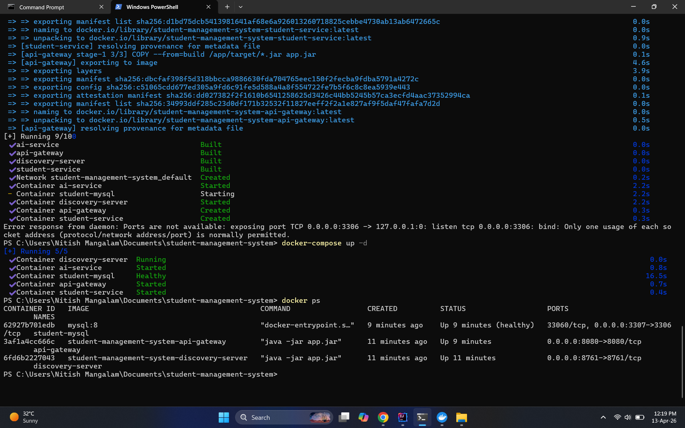

# Secure Student Management System with AI Integration

# Secure Student Management System with AI Integration

This is a professional **Microservices-based** ecosystem. It features a distributed architecture where Java-based services communicate with a Python AI brain using **Kafka** as an event-driven backbone.

## 🚀 Key Features
- **Centralized Gateway**: Managed via Spring Cloud Gateway.
- **Robust Security**: JWT-based authentication and authorization.
- **Event-Driven AI**: Python service consumes Kafka events to provide student career guidance.
- **Full Observability**: Service registry with Eureka and distributed tracing with Zipkin.
- **Containerized Deployment**: Fully dockerized environment for seamless setup.

## 📸 System Architecture & Evidence

### 1. Docker Deployment (Visual Proof)
The entire ecosystem (Databases, Messaging, and 6 Microservices) running healthy in a containerized environment.

### 2. Service Discovery (Eureka)
Shows all microservices (Gateway, Auth, Student, Notification) registered and healthy.

### 3. Distributed Tracing (Zipkin)
Proof of request propagation across the microservice boundaries.

### 4. API Integration (Postman)
Successful end-to-end test showing user registration and profile creation.

### 5. AI Brain Output (Python)
Real-time career recommendation generated by the AI service upon receiving Kafka events.

## 🛠️ Tech Stack
- **Backend**: Java, Spring Boot, Spring Security, Hibernate
- **AI/ML**: Python, FastAPI, Uvicorn
- **Messaging**: Apache Kafka
- **DevOps**: Docker, Docker Compose
- **Monitoring**: Spring Cloud Sleuth/Zipkin, Eureka
- **Database**: MySQL (Accessible on Port `3307` via Docker)

## 📦 How to Run
1. Clone the repository.
2. Ensure Docker Desktop is running.
3. Run `docker-compose up --build -d` in the root folder.